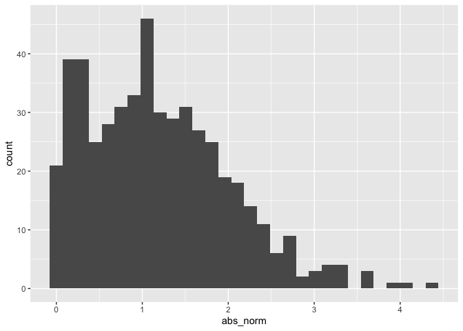

Simple document
================

I’m an R Markdown document!

# Section 1

Here’s a **code chunk** that samples from a *normal distribution*:

``` r
samp = rnorm(100)
length(samp)
```

    ## [1] 100

# Section 2

I can take the mean of the sample, too! The mean is -0.1.

``` r
mean(samp)
```

    ## [1] -0.0989929

``` r
round(mean(samp),2)
```

    ## [1] -0.1

# Section 3

This is going to make a plot! \## Plot for last time

``` r
plot_df = 
  tibble(
    x = rnorm( n = 1000),
    y = 1 + 2 * x + rnorm( n = 1000)
  )

ggplot(plot_df, aes(x = x, y = y)) + geom_point()
```

<!-- -->

# Learning assessment

Write a named code chunk that creates a dataframe comprised of: a
numeric variable containing a random sample of size 500 from a normal
variable with mean 1; a logical vector indicating whether each sampled
value is greater than zero; and a numeric vector containing the absolute
value of each element. Then, produce a histogram of the absolute value
variable just created. Add an inline summary giving the median value
rounded to two decimal places. What happens if you set eval = FALSE to
the code chunk? What about echo = FALSE?

## Plot for learning assessment

Solution for LA

``` r
la_df = 
  tibble(
    norm = rnorm( n = 500, mean = 1),
    logical = norm > 0,
    abs_norm = abs(norm) # Google "absolute value r"
  )

ggplot(la_df, aes(x = abs_norm)) + geom_histogram()
```

    ## `stat_bin()` using `bins = 30`. Pick better value with `binwidth`.

<!-- -->

``` r
median_samp = median(pull(la_df, norm))

round(median_samp, digits = 2) #median value rounded to two decimal places
```

    ## [1] 1.04

The median of the variable containing absolute values is 1.04.
